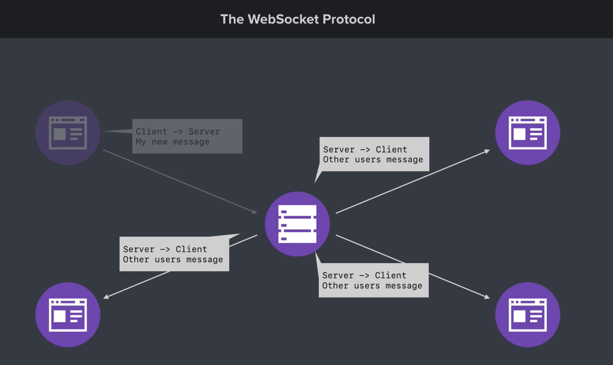

## Chat App

#### INITIAL SET UP

> Create a folder, src/index.js
> npm init	// set all default
> Install express then app = express()
> To load a static folder <Static files are files that clients download as they are from the server>, create a `public` dir
> Express, by default does not allow to serve static files. We need to enable it using the following built-in middleware: app.use(express.static(publicPath)))
	where publicPath = path.join(__dirname, '../public')	// path is node module, no need to install, just require
> app.listen(port)	// optionally callback can be added to log about server running
> node src/index.js (to run the app)

> Add scripts inside package.json
 "scripts": {
    "start": "node src/index.js", /* Added start script */
    "dev": "nodemon src/index.js" /* Added dev script. Install nodemon using "npm i nodemon --save-dev" to install as a dev dependency*/ 
  }
> Now, npm run start (to run the app),
	npm run dev (to run the app in dev mode) -> nodemon helps running the app by itself after every save


#### WEB SOCKET PROTOCAL

> allows full-duplex (bi-directional) communication (the client can initiate communication with the server and the server can initiate communication with the client)
> a separate protocol from HTTP. In HTTP, it was the client’s job to initiate the request asking for the data from the sever and then the server will respond. But server couldn’t communicate by itself
 > Persistent connection b/w client and server (like a chat app)



> socket.io (npm i socket.io)
> To use `socket.io` with express, we need to customize express server a bit
	require http, 	// core node module
	socket = require socket.io
	server = http.createServer(app)		// until now it’s same as app express server used to be
	Now, server.listen(port) will listen
> io = socketio(server)     // Now the server supports websockets
> io.on('connection', () => {
    console.log('New WebSocket connection')    // Need to load client side of the socket library 
  })
> To load client side of the socket library, add
<script src="/socket.io/socket.io.js"></script>
> Now we need to add a file to use io() on the client side:
<script src="/js/chat.js"></script>
> Inside `chat.js`, just write `io()`. Save an refresh the browser to see in the logs:
    `New WebSocket connection`
> This will be printed on each new connection (client)

> socket.emit('countUpdate', count)     // emits to one specific connection
    i.e. Pressing +1 will send updated count to only that client who is pressing the button
  io.emit('countUpdate', count)         // emits to all connected sockets
    i.e. Pressing +1 will send updated count to all connected clients

> socket.broadcast.emit('message', 'A new user has joined') 
    // broadcast to every user other than the user joining

> socket.on('disconnect', () => { // broadcast to every user other than the user leaving
        io.emit('message', 'A user has left!') 
    })

> socket.join(room)

  socket.broadcast.to(room).emit('message', generateMessage('A new user has joined'))     // to send the message to everyone else in a room


#### Deploying the project

> git init
> Create .gitignore file and write (`node_modules`) to skip this folder to upload
> git add . (to add all files to the staging area)
> git status (optional - just to make sure the list of files that are in staging are correct)
> git commit -m "Init commit" (to commit the changes)

> Create a new repo on GitHub (with any name)
> Click create and go to "…or push an existing repository from the command line" and execute the commands
```
git remote add origin https://github.com/kaushalnavneet/chat-app.git
git branch -M main
git push -u origin main
```
> Refresh the GitHub repo page (https://github.com/kaushalnavneet/chat-app) and it should have all the latest changes

> Sign up / Login to Heroku
> Install heroku cli (installed it using brew)
> heroku login
> heroku create chat-app-nav (any name)
> git push heroku main

git rm -f --cached client && git add . && git commit -m 'Add client folder back to git repo' && git push heroku main